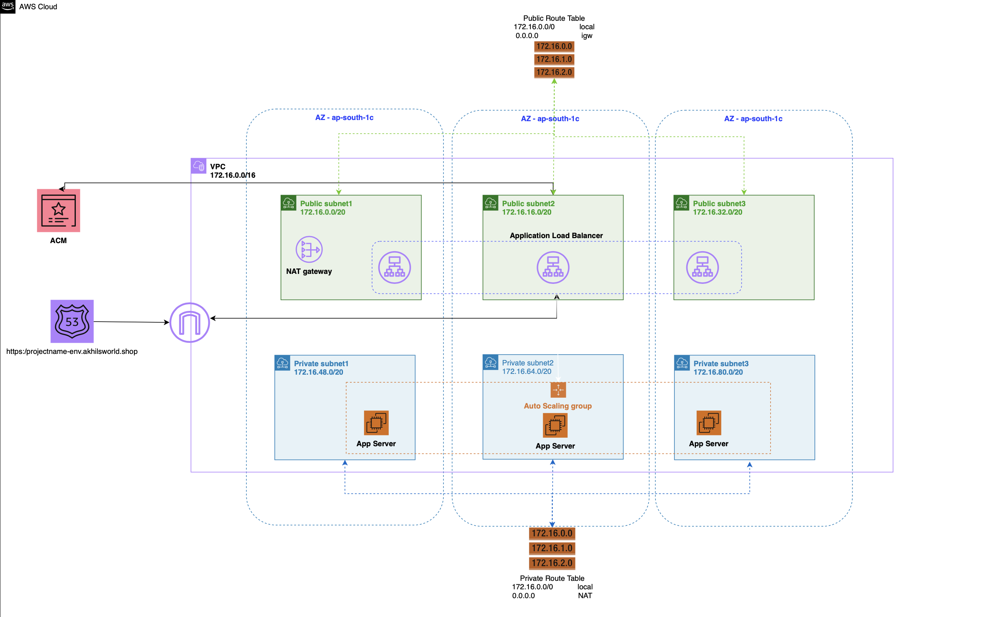

# ☁️ AWS Scalable Web Application Architecture

This project showcases a **highly available, secure, and scalable web application** architecture on AWS using Terraform.It is built using core AWS services such as EC2, VPC, ALB, Auto Scaling, Route 53, and more.

---

## 📌 Architecture Overview

This setup demonstrates:

- Multi-AZ Deployment
- Public and Private Subnet Segregation
- Secure App Servers behind a Load Balancer
- Internet access for private instances via NAT Gateway
- Domain and HTTPS integration using Route 53 and ACM

---

## 🗺️ Network Design

- **VPC CIDR:** `172.16.0.0/16`
- **Public Subnets (x3):**
  - `172.16.0.0/20`
  - `172.16.16.0/20`
  - `172.16.32.0/20`
- **Private Subnets (x3):**
  - `172.16.48.0/20`
  - `172.16.64.0/20`
  - `172.16.80.0/20`
- **Availability Zones:** Spread across 3 AZs in `ap-south-1` (Mumbai)

---

## 🧱 Core Components

### ✅ VPC
- Isolated networking environment with 6 subnets (3 public, 3 private)

### ✅ Application Load Balancer (ALB)
- Deployed in public subnet
- Distributes incoming traffic to app servers
- Integrated with **Route 53** and **ACM** for secure HTTPS

### ✅ EC2 Auto Scaling Group
- Launched in private subnets
- Scales app servers automatically based on demand

### ✅ NAT Gateway
- Placed in public subnet
- Enables internet access for private subnet instances

### ✅ Route 53
- Domain: `https://projectname-env.akhilsworld.shop`
- DNS routing to the ALB

### ✅ AWS Certificate Manager (ACM)
- Provides SSL certificate for secure traffic over HTTPS

---

## 🔐 Security & Best Practices

- App servers are in **private subnets** – no direct internet exposure
- ALB handles all public traffic securely via HTTPS
- NAT Gateway provides controlled outbound internet access
- Auto Scaling ensures high availability and cost-efficiency
- Multi-AZ setup ensures fault tolerance

---

## 📈 Scalability

- The application auto-scales based on traffic using EC2 Auto Scaling Groups.
- Load balancer ensures even distribution and health-check-based routing.

---
